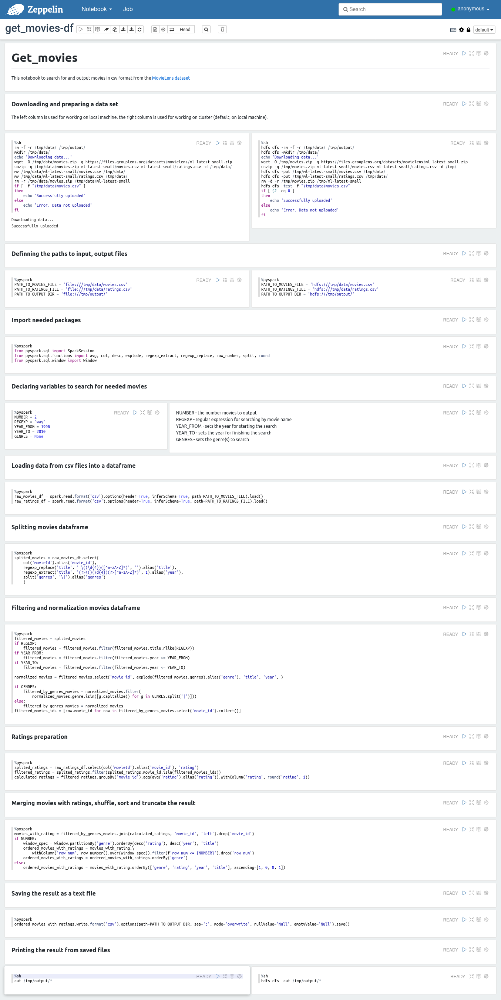

# Get-movies

Zeppelin notebook utility for searching and output the movies in csv format from the dataset

## Movies data

Utility use the [MovieLens dataset](https://grouplens.org/datasets/movielens/)

## Dependencies

Utility requires Apache Zeppelin 0.10.0+ to run  

## Usage

To use jast run all paragraphs 

## Screenshot of the zeppelin notebook for quick reference

